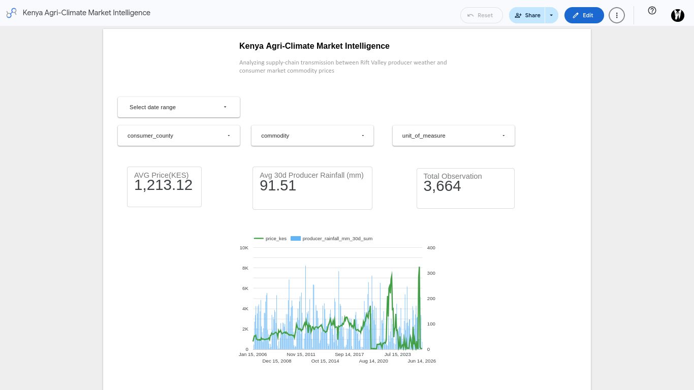
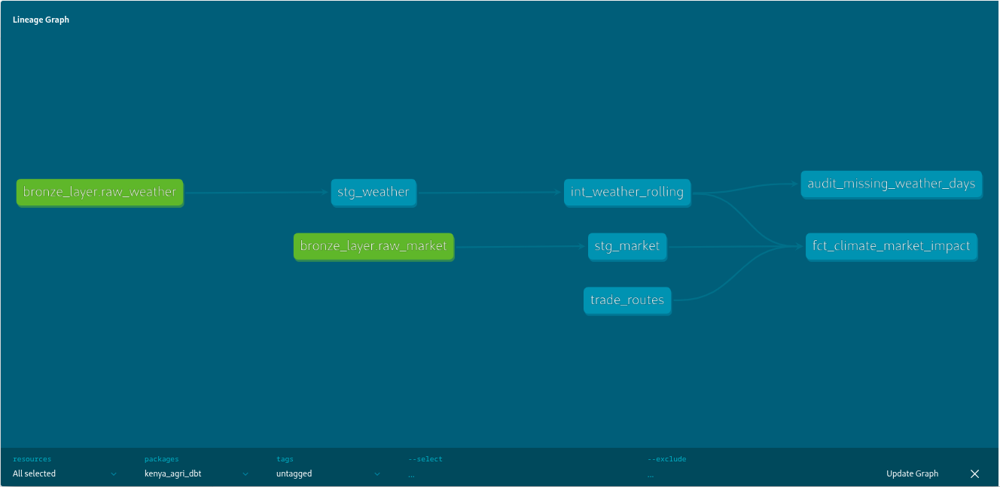

# `kenya_agri_dbt` — Analytics Engineering Layer

> **dbt project for the Kenya Agri-Climate Data Pipeline**
> Transforming raw BigQuery Bronze tables into analytics-ready Gold-layer fact tables to quantify the macroeconomic transmission between extreme weather events and agricultural commodity prices across Kenya.

---

## Looker Studio — BI Dashboard

The final `fct_climate_market_impact` table powers a live **Looker Studio** executive dashboard: **Kenya Agri-Climate Market Intelligence**.



> **Dashboard KPIs (all-time defaults):**
> - **AVG Price (KES):** `1,213.12` — average commodity price across all consumer hubs
> - **Avg 30d Producer Rainfall (mm):** `91.51` — average 30-day cumulative rainfall in producer counties
> - **Total Observations:** `3,664` — matched climate x market records in the fact table
>
> The dual-axis time series overlays `price_kes` (green line) against `producer_rainfall_mm_30d_sum` (blue bars) from 2006 to 2026, making the inverse correlation between drought periods and price spikes immediately visible.
>
> **Interactive filters:** `date range`, `consumer_county`, `commodity`, `unit_of_measure`

---

## dbt Lineage Graph

The following lineage graph was generated from `dbt docs generate && dbt docs serve`. It shows the full dependency chain from raw BigQuery sources through to the final Gold-layer fact table.



**Reading the graph (left to right):**

| Node | Color | Layer | Description |
|------|-------|-------|-------------|
| `bronze_layer.raw_weather` | Green | Source | Raw BigQuery table — daily weather for producer counties |
| `bronze_layer.raw_market` | Green | Source | Raw BigQuery table — commodity prices for consumer hubs |
| `stg_weather` | Blue | Staging (Silver) | Cleaned, typed, surrogate-keyed weather records |
| `stg_market` | Blue | Staging (Silver) | Cleaned, typed, deduplicated market price records |
| `int_weather_rolling` | Blue | Intermediate | Rolling window climate stress metrics per county |
| `trade_routes` | Blue | Seed | Static CSV — consumer-to-producer supply chain mapping |
| `fct_climate_market_impact` | Blue | Mart (Gold) | Final OBT fact table served to the BI dashboard |
| `audit_missing_weather_days` | Blue | Analysis | Ad-hoc audit query for data completeness QA |

---

## Project Overview

This dbt project is the **Transform (T)** phase of the broader Kenya Agri-Market & Climate Impact ELT pipeline. It connects to a Google BigQuery Bronze layer (raw tables loaded by Kestra) and models the data through a **3-tier dimensional architecture**:

```
Bronze (Raw BigQuery)  ──►  Silver (Staging Views)  ──►  Gold (Mart Tables)
     ↑                              ↑                           ↑
 [Kestra EL]              [stg_market, stg_weather]   [fct_climate_market_impact]
```

**Core analytical question answered:**
> *How does producer-region climate stress (rainfall deficit, heat events) propagate through supply chains to drive commodity price inflation in Kenya's major consumer hubs?*

---

## Architecture & ELT Context

This project sits at layer **4** of the full pipeline:

```
┌─────────────────────────────────────────────────────────────────────┐
│                      FULL PIPELINE OVERVIEW                         │
├──────────┬──────────────┬───────────────┬───────────────────────────┤
│ Phase 1  │  Phase 2     │  Phase 3      │  Phase 4 (THIS PROJECT)   │
│ EXTRACT  │  LOAD to GCS │  LOAD to BQ   │  TRANSFORM (dbt)          │
│          │              │  (Bronze)     │                            │
│ Python   │  GCS Bucket  │  raw_weather  │  stg_weather              │
│ scripts  │  (landing    │  raw_market   │  stg_market               │
│ via      │   zone &     │               │  int_weather_rolling      │
│ Kestra   │   backup)    │               │  fct_climate_market_impact│
└──────────┴──────────────┴───────────────┴───────────────────────────┘
                                                         │
                                                         ▼
                                              ┌────────────────────┐
                                              │  Looker Studio BI  │
                                              │  Dashboard         │
                                              └────────────────────┘
```

**Data Sources feeding the Bronze Layer:**

| Source | API / Dataset | Scope | Granularity |
|--------|---------------|-------|-------------|
| **Open-Meteo Historical API** | `archive-api.open-meteo.com` | 3 producer counties, 20+ years | Daily |
| **WFP / HDX Kenya Food Prices** | `data.humdata.org` | 3 consumer counties, 20+ years | Weekly/Monthly |

---

## 📁 Project Structure

```
kenya_agri_dbt/
│
├── dbt_project.yml              # Project config — name, profile, materializations
├── packages.yml                 # dbt-labs/dbt_utils v1.3.0
├── package-lock.yml             # Locked dependency manifest
│
├── models/
│   ├── staging/                 # Silver layer — views
│   │   ├── sources.yml          # BigQuery source declarations (bronze_layer)
│   │   ├── schema.yml           # Column-level tests & descriptions
│   │   ├── stg_market.sql       # Consumer commodity prices — cleaned & deduplicated
│   │   └── stg_weather.sql      # Producer weather metrics — cleaned & typed
│   │
│   ├── intermediate/            # Business logic layer — views
│   │   ├── schema.yml           # Column-level tests & descriptions
│   │   └── int_weather_rolling.sql  # Rolling window climate stress metrics
│   │
│   └── marts/                   # Gold layer — tables (served to BI)
│       ├── schema.yml           # Column-level tests & descriptions
│       └── fct_climate_market_impact.sql  # Final OBT fact table
│
├── seeds/
│   ├── schema.yml               # Seed tests (unique_combination_of_columns)
│   └── trade_routes.csv         # Static supply chain mapping (consumer → producer)
│
├── docs/
│   ├── lineage_graph.png        # dbt DAG screenshot
│   └── dashboard_screenshot.png # Looker Studio dashboard screenshot
│
├── analyses/                    # Ad-hoc SQL queries (not materialized)
├── macros/                      # Custom Jinja macros
├── snapshots/                   # dbt snapshots (SCD Type 2)
└── tests/                       # Singular custom SQL tests
```

---

## Dimensional Modeling Strategy

The data flows through **3 distinct modeling layers**, each with a clear purpose and materialization strategy:

### Layer 1 — Staging (Silver) · `materialized: view`

The staging layer is the first transformation point. Its sole responsibility is **standardization** — no business logic, no joins.

---

#### `stg_market`

**Source:** `bronze_layer.raw_market` — BigQuery table `kestra-sandbox-504410.kenya_agri_market.raw_market`

**Purpose:** Cleans and standardizes the WFP commodity price records for Kenya's 3 consumer hubs.

**Transformations applied:**

1. **Surrogate Key Generation** — uses `dbt_utils.generate_surrogate_key(['date','county','market','commodity','unit'])` to produce a deterministic `market_id` hash primary key.
2. **Type Casting** — all columns are explicitly cast to their correct BigQuery types (`DATE`, `STRING`, `FLOAT64`).
3. **Deduplication** — a `QUALIFY ROW_NUMBER() OVER (PARTITION BY market_id ORDER BY price_kes DESC) = 1` window function retains only the first (highest price) record per unique market event, eliminating any duplicate ingestion artifacts from the Bronze layer.

**Output Schema:**

| Column | Type | Description |
|--------|------|-------------|
| `market_id` | `STRING` | **Primary Key** — surrogate key (MD5 hash of date, county, market, commodity, unit) |
| `price_date` | `DATE` | Date the commodity price was recorded |
| `county` | `STRING` | Consumer hub county (Nairobi, Mombasa, Turkana) |
| `market` | `STRING` | Specific market name within the county |
| `commodity` | `STRING` | Agricultural commodity (e.g., Maize, Beans, Potatoes) |
| `unit_of_measure` | `STRING` | Unit (e.g., KG, 90 KG bag) |
| `price_kes` | `FLOAT64` | Price in Kenyan Shillings |

**Data Tests:** `market_id` → `unique`, `not_null` · `price_kes` → `not_null`

---

#### `stg_weather`

**Source:** `bronze_layer.raw_weather` — BigQuery table `kestra-sandbox-504410.kenya_agri_market.raw_weather`

**Purpose:** Cleans and standardizes daily agro-meteorological readings for Kenya's 3 producer counties.

**Transformations applied:**

1. **Surrogate Key Generation** — `dbt_utils.generate_surrogate_key(['date', 'county'])` creates a deterministic `weather_id` for each unique county × day combination.
2. **Type Casting** — all metrics cast to `FLOAT64`; date cast to `DATE`.
3. **Derived Metric** — `temp_mean_c` is calculated inline as `ROUND((temp_max_c + temp_min_c) / 2.0, 2)` for use in downstream rolling averages.

**Output Schema:**

| Column | Type | Description |
|--------|------|-------------|
| `weather_id` | `STRING` | **Primary Key** — surrogate key (date + county) |
| `weather_date` | `DATE` | Observation date (Africa/Nairobi timezone) |
| `county` | `STRING` | Producer county (Trans Nzoia, Uasin Gishu, Nakuru) |
| `temp_max_c` | `FLOAT64` | Maximum daily temperature at 2m (°C) |
| `temp_min_c` | `FLOAT64` | Minimum daily temperature at 2m (°C) |
| `temp_mean_c` | `FLOAT64` | Derived mean temperature: `(max + min) / 2` (°C) |
| `precipitation_mm` | `FLOAT64` | Total daily precipitation (mm) |
| `evapotranspiration_mm` | `FLOAT64` | FAO-56 reference evapotranspiration (mm) |
| `wind_speed_max_kmh` | `FLOAT64` | Maximum daily wind speed at 10m (km/h) |
| `solar_radiation_mj_m2` | `FLOAT64` | Total shortwave radiation (MJ/m²) |

**Data Tests:** `weather_id` → `unique`, `not_null` · `county` → `not_null` · `weather_date` → `not_null`

---

### Layer 2 — Intermediate (Business Logic) · `materialized: view`

The intermediate layer applies **agricultural domain business logic** that converts raw daily weather metrics into analytically meaningful climate stress indicators using BigQuery window functions.

---

#### `int_weather_rolling`

**Source:** `ref('stg_weather')`

**Purpose:** Calculates trailing window aggregations per county to produce the climate stress signals used in the final fact table. All windows are **partitioned by `county`** to ensure metrics never bleed across geographic boundaries.

**Rolling Metrics Calculated:**

| New Column | Window | Agricultural Interpretation |
|------------|--------|-----------------------------|
| `temp_mean_c_7d_avg` | 7-day trailing average (`ROWS BETWEEN 6 PRECEDING AND CURRENT ROW`) | **Heat Stress Indicator** — captures sustained high temperatures that damage crops or accelerate evaporation |
| `rainfall_mm_14d_sum` | 14-day trailing sum (`ROWS BETWEEN 13 PRECEDING AND CURRENT ROW`) | **Short-Term Moisture** — indicates recent soil moisture availability and immediate crop water stress |
| `rainfall_mm_30d_sum` | 30-day trailing sum (`ROWS BETWEEN 29 PRECEDING AND CURRENT ROW`) | **Drought Indicator** — the primary drought signal; a persistent deficit below ~30mm triggers food price cascades |
| `evapotranspiration_mm_14d_avg` | 14-day trailing average (`ROWS BETWEEN 13 PRECEDING AND CURRENT ROW`) | **Crop Water Demand** — captures the atmospheric demand for water; high ET during low rainfall = severe stress |

**Data Tests:** `weather_id` → `unique`, `not_null` (verifies window functions produced no duplicate rows) · `county` → `not_null`

---

### Layer 3 — Marts / Gold · `materialized: table`

The Mart layer produces the final, BI-ready **One Big Table (OBT)** served directly to Looker Studio. It is materialized as a **physical BigQuery table** for maximum query performance.

---

#### `fct_climate_market_impact` — Fact Table

**Sources:** `ref('stg_market')` + `ref('int_weather_rolling')` + `ref('trade_routes')`

**Purpose:** The analytical centrepiece of the pipeline. It answers the core question: *for every commodity price recorded in a consumer hub, what was the concurrent climate stress in the supplying producer county?*

**Join Strategy — 3-way Bridge Join:**

```sql
market m
  INNER JOIN trade_routes tr
    ON m.county = tr.consumer_county
    AND m.commodity = tr.commodity
  INNER JOIN weather w
    ON tr.primary_producer_county = w.county
    AND m.price_date = w.weather_date
```

> **Why `INNER JOIN`?** The `trade_routes` seed provides deterministic supply chain mapping. Only records where a known producer-consumer-commodity route AND a matching weather observation exist on the same date are retained. This prevents Cartesian fan-out and ensures every fact row has full analytical context.

**Output Schema:**

| Column | Type | Description |
|--------|------|-------------|
| `impact_id` | `STRING` | **Primary Key** — surrogate key of `market_id` + `weather_id` |
| `price_date` | `DATE` | Date of the commodity price observation |
| `consumer_county` | `STRING` | County where the commodity was sold |
| `consumer_market` | `STRING` | Specific market within the consumer county |
| `commodity` | `STRING` | Agricultural commodity traded |
| `unit_of_measure` | `STRING` | Unit of measurement |
| `price_kes` | `FLOAT64` | Commodity price in Kenyan Shillings |
| `producer_county` | `STRING` | Supplying producer county (mapped via `trade_routes`) |
| `producer_temp_mean_c_7d_avg` | `FLOAT64` | 7-day rolling avg temperature in producer county |
| `producer_rainfall_mm_14d_sum` | `FLOAT64` | 14-day cumulative rainfall in producer county |
| `producer_rainfall_mm_30d_sum` | `FLOAT64` | 30-day cumulative rainfall in producer county (drought indicator) |
| `producer_evapotranspiration_mm_14d_avg` | `FLOAT64` | 14-day avg evapotranspiration in producer county |
| `producer_solar_radiation_mj_m2` | `FLOAT64` | Solar radiation on that date in producer county |
| `producer_wind_speed_max_kmh` | `FLOAT64` | Max wind speed on that date in producer county |

**Data Tests:** `impact_id` → `unique`, `not_null` · `consumer_county` → `not_null` · `producer_county` → `not_null` · `price_kes` → `not_null`

---

### Seed — `trade_routes`

**File:** `seeds/trade_routes.csv`

**Purpose:** Injects **supply-chain business logic** as static reference data. This seed defines which producer county supplies each commodity to each consumer hub. Without it, joining market data to weather data would produce a Cartesian product — analytically meaningless.

**Current Mappings (22 routes):**

| Consumer County | Commodity | Primary Producer County |
|-----------------|-----------|------------------------|
| Nairobi | Maize / Maize (white) / Maize (white, dry) | Nakuru |
| Nairobi | Beans / Beans (dry) / Beans (rosecoco) | Nakuru |
| Nairobi | Potatoes (Irish) | Nakuru |
| Nairobi | Cabbage | Nakuru |
| Turkana | Maize / Maize (white) / Maize (white, dry) | Trans Nzoia |
| Turkana | Beans / Beans (dry) / Sorghum | Trans Nzoia |
| Mombasa | Maize / Maize (white) / Maize (white, dry) | Uasin Gishu |
| Mombasa | Beans / Beans (dry) / Beans (yellow) | Uasin Gishu |
| Mombasa | Potatoes (Irish) | Nakuru |

**Seed Tests:** `dbt_utils.unique_combination_of_columns` on `(consumer_county, commodity)` — ensures no ambiguous duplicate routes exist.

---

## Data Quality & Testing Strategy

Data integrity is enforced at **every layer** using a defence-in-depth approach. Upstream extraction errors are caught before they can silently corrupt the BI dashboard.

### Generic Tests (Schema-level)

Defined in each `schema.yml`, applied via `dbt test`:

| Layer | Model | Test | Column(s) |
|-------|-------|------|-----------| 
| Staging | `stg_market` | `unique`, `not_null` | `market_id` |
| Staging | `stg_market` | `not_null` | `price_kes` |
| Staging | `stg_weather` | `unique`, `not_null` | `weather_id` |
| Staging | `stg_weather` | `not_null` | `county`, `weather_date` |
| Intermediate | `int_weather_rolling` | `unique`, `not_null` | `weather_id` |
| Intermediate | `int_weather_rolling` | `not_null` | `county` |
| Marts | `fct_climate_market_impact` | `unique`, `not_null` | `impact_id` |
| Marts | `fct_climate_market_impact` | `not_null` | `consumer_county`, `producer_county`, `price_kes` |

### Seed Tests

```yaml
# seeds/schema.yml
- dbt_utils.unique_combination_of_columns:
    combination_of_columns: [consumer_county, commodity]
```

Guards against duplicate or ambiguous trade route mappings.

### Singular Tests

Custom SQL assertions stored in `tests/` — for example, ensuring the mathematical invariant that `rainfall_mm_14d_sum <= rainfall_mm_30d_sum` always holds on the same date. A violation would indicate broken rolling window logic.

### Analysis — `audit_missing_weather_days`

An ad-hoc analysis query (visible in the lineage graph) that audits data completeness by identifying counties and date ranges with missing daily weather observations. Used for data quality reporting, not materialized as a model.

---

## dbt Configuration

### `dbt_project.yml`

```yaml
name: 'kenya_agri_dbt'
version: '1.0.0'
profile: 'kenya_agri_dbt'

models:
  kenya_agri_dbt:
    staging:
      +materialized: view      # Low-cost, always fresh, no storage overhead
    intermediate:
      +materialized: view      # Business logic views — computed on query
    marts:
      +materialized: table     # Physical BQ table for BI performance
```

**Materialization rationale:**
- **`view`** for Staging & Intermediate: These layers transform relatively few columns, run quickly, and benefit from always reflecting the latest source data without storage cost.
- **`table`** for Marts: The `fct_climate_market_impact` fact table involves a 3-way join across potentially millions of rows. Materializing it as a physical table ensures sub-second Looker Studio queries.

### `packages.yml`

```yaml
packages:
  - package: dbt-labs/dbt_utils
    version: 1.3.0
```

**`dbt_utils` usage in this project:**
- `dbt_utils.generate_surrogate_key()` — used in `stg_market`, `stg_weather`, and `fct_climate_market_impact` to produce deterministic MD5-based surrogate primary keys.
- `dbt_utils.unique_combination_of_columns` — used in the `trade_routes` seed test.

### Source Declaration (`sources.yml`)

```yaml
sources:
  - name: bronze_layer
    database: kestra-sandbox-504410
    schema: kenya_agri_market
    tables:
      - name: raw_market      # 20 years of WFP commodity prices
      - name: raw_weather     # 20 years of Open-Meteo daily weather
```

Referenced in staging models as `{{ source('bronze_layer', 'raw_market') }}` and `{{ source('bronze_layer', 'raw_weather') }}`.

---

## Domain Knowledge — Producer & Consumer Hubs

Understanding the geographic and agricultural logic of this pipeline is essential for correctly interpreting the analytics.

### Producer Counties (Weather Data)

These are Kenya's agricultural heartland — where the food is **grown**:

| County | Coordinates | Agricultural Significance |
|--------|-------------|--------------------------|
| **Trans Nzoia** | 1.0507°N, 34.9570°E | Kenya's primary **maize belt** — the "breadbasket." Rainfall deficits here directly trigger national maize shortages. |
| **Uasin Gishu** | 0.5527°N, 35.3027°E | Major **wheat and maize** producer. Eldoret is the regional hub. Critical for Mombasa's coastal food supply. |
| **Nakuru** | 0.3071°S, 36.0722°E | Key **horticultural county** — potatoes, cabbages, beans. Primary supplier to Nairobi's informal markets. |

### Consumer Counties (Market Price Data)

These are Kenya's major urban markets — where the food is **sold and priced**:

| County | Type | Market Significance |
|--------|------|---------------------|
| **Nairobi** | Capital city | Largest consumer market. Price signals here reflect national food inflation trends. |
| **Mombasa** | Coastal hub | Import/export gateway. Prices influenced by both domestic supply and international commodity markets. |
| **Turkana** | Arid/semi-arid | **Food insecurity hotspot.** Prices here are most sensitive to supply disruptions — the highest-risk county for food crises. |

---

## Local Development Setup

### Prerequisites

- Python `>=3.14` (managed via `uv`)
- `uv` package manager (`pip install uv`)
- Google Cloud Platform account with BigQuery API enabled
- GCP Service Account with `roles/bigquery.dataEditor` and `roles/bigquery.jobUser`

### Installation

```bash
# Navigate to the analytics directory
cd analytics/

# Create a virtual environment and install dependencies
uv venv
source .venv/bin/activate

# Install dbt-bigquery (pinned in pyproject.toml)
uv pip install "dbt-bigquery>=1.12.0"
```

### Profile Setup

Create or update `~/.dbt/profiles.yml` with your BigQuery credentials:

```yaml
kenya_agri_dbt:
  target: dev
  outputs:
    dev:
      type: bigquery
      method: service-account
      project: kestra-sandbox-504410
      dataset: kenya_agri_dbt_dev       # dbt will write models here
      keyfile: /path/to/gcp-service-account.json
      location: EU
      threads: 4
      timeout_seconds: 300
```

### Running the Project

```bash
# Navigate to the dbt project directory
cd analytics/kenya_agri_dbt/

# 1. Install dbt packages (dbt_utils)
dbt deps

# 2. Validate connection to BigQuery
dbt debug

# 3. Load seed data (trade_routes.csv → BigQuery)
dbt seed

# 4. Run all models in dependency order
dbt run

# 5. Execute data quality tests
dbt test

# 6. Run the full pipeline in a single command (seed + run + test)
dbt build

# 7. Generate and serve lineage documentation locally
dbt docs generate
dbt docs serve
# Navigate to http://localhost:8080 to view the interactive lineage graph
```

### Selective Runs

```bash
# Run only staging models
dbt run --select staging

# Run a specific model and all its upstream dependencies
dbt run --select +fct_climate_market_impact

# Run all models downstream of a change to stg_weather
dbt run --select stg_weather+

# Test a single model
dbt test --select stg_market
```

---

## Analytics Patterns & Sample Queries

Once `fct_climate_market_impact` is built, analysts can query the Gold layer directly in BigQuery or through the Looker Studio dashboard.

### Query 1 — 30-Day Rainfall vs. Maize Price in Nairobi

```sql
SELECT
    price_date,
    AVG(price_kes)                    AS avg_price_kes,
    AVG(producer_rainfall_mm_30d_sum) AS avg_rainfall_30d_mm
FROM `kestra-sandbox-504410.kenya_agri_dbt.fct_climate_market_impact`
WHERE
    consumer_county = 'Nairobi'
    AND commodity LIKE '%Maize%'
GROUP BY price_date
ORDER BY price_date;
```

### Query 2 — Heat Stress Threshold Breach Analysis

```sql
-- Identify months where producer 7-day avg temperature exceeded 32°C
-- and correlate with commodity price spikes
SELECT
    FORMAT_DATE('%Y-%m', price_date) AS month,
    consumer_county,
    commodity,
    AVG(price_kes)                   AS avg_price_kes,
    AVG(producer_temp_mean_c_7d_avg) AS avg_heat_stress_c
FROM `kestra-sandbox-504410.kenya_agri_dbt.fct_climate_market_impact`
WHERE producer_temp_mean_c_7d_avg > 32
GROUP BY month, consumer_county, commodity
ORDER BY avg_price_kes DESC;
```

### Query 3 — Turkana Food Security Alert

```sql
-- Flag periods where Turkana bean prices spike AND producer rainfall is critically low
SELECT
    price_date,
    commodity,
    price_kes,
    producer_county,
    producer_rainfall_mm_30d_sum
FROM `kestra-sandbox-504410.kenya_agri_dbt.fct_climate_market_impact`
WHERE
    consumer_county = 'Turkana'
    AND commodity LIKE '%Beans%'
    AND producer_rainfall_mm_30d_sum < 20  -- Drought threshold (mm)
    AND price_kes > 5000
ORDER BY price_date DESC;
```

---

## Package Dependencies

| Package | Version | Usage |
|---------|---------|-------|
| `dbt-bigquery` | `>=1.12.0` | BigQuery adapter — required for BigQuery-specific SQL (`QUALIFY`, window functions) |
| `dbt-labs/dbt_utils` | `1.3.0` | `generate_surrogate_key()`, `unique_combination_of_columns` |

---

## Planned Enhancements

| Priority | Enhancement | Description |
|----------|-------------|-------------|
| 🔴 High | **Partitioning & Clustering** | Partition `fct_climate_market_impact` on `price_date` and cluster on `consumer_county` + `commodity` for significantly faster Looker Studio queries at scale |
| 🔴 High | **Source Freshness Checks** | Add `freshness:` blocks to `sources.yml` to alert when the Bronze tables haven't been updated in >2 days |
| 🟡 Medium | **`dim_county` table** | Separate dimension table for counties with metadata (type: producer/consumer, region, coordinates, population) |
| 🟡 Medium | **`dim_commodity` table** | Dimension table for commodities with nutritional category and seasonality metadata |
| 🟡 Medium | **CI/CD with GitHub Actions** | Automated `dbt test` and `dbt compile` on every pull request |
| 🟢 Low | **Singular Test — Rolling Sum Invariant** | Assert `rainfall_mm_14d_sum <= rainfall_mm_30d_sum` on every date/county combination |
| 🟢 Low | **`dbt-expectations` package** | Richer data quality assertions (e.g., `expect_column_values_to_be_between` for temperature ranges) |

---

## Related Resources

- **Root Pipeline README:** [`../../README.md`](../../README.md) — full ELT architecture documentation
- **dbt Documentation:** [docs.getdbt.com](https://docs.getdbt.com)
- **dbt_utils Package:** [hub.getdbt.com/dbt-labs/dbt_utils](https://hub.getdbt.com/dbt-labs/dbt_utils/latest/)
- **Open-Meteo Historical API:** [open-meteo.com/en/docs/historical-weather-api](https://open-meteo.com/en/docs/historical-weather-api)
- **WFP Kenya Food Prices (HDX):** [data.humdata.org](https://data.humdata.org/dataset/wfp-food-prices-for-kenya)
- **Google BigQuery dbt Adapter:** [docs.getdbt.com/docs/core/connect-data-platform/bigquery-setup](https://docs.getdbt.com/docs/core/connect-data-platform/bigquery-setup)

---

*Analytics Engineering Layer · Kenya Agri-Climate Data Pipeline · Built with dbt + BigQuery*